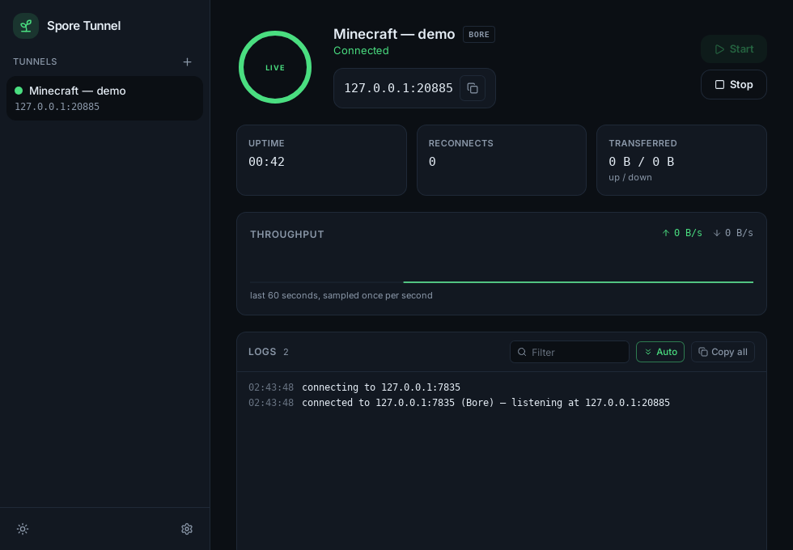
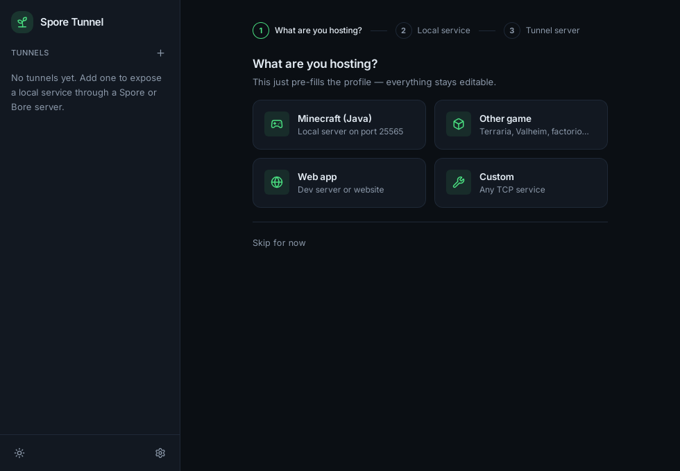

# Spore Tunnel

> Forked from [bore-tunnel-gui](https://github.com/Rastrian/bore-tunnel-gui) (MIT).

A Windows desktop app that exposes local TCP services — Minecraft servers, game
hosts, dev web servers — to the internet through a **Bore** or **Spore** tunnel
server. Both tunnel protocols are implemented natively in Rust: no `bore.exe`,
no sidecar binaries, no CLI. One installer, a three-step wizard, and your
service has a public address.




## Features

- **Multiple tunnels at once** — each profile (server + local service + ports)
  is an independent tunnel with its own status, logs and stats, startable and
  stoppable from the sidebar or the system tray.
- **Native Bore + Spore protocol** — NUL-delimited JSON control protocol with
  HMAC-SHA256 authentication, implemented from scratch. Talks to plain Bore
  servers *and* Spore servers, negotiating the extended dialect safely (see
  [How it works](#how-it-works)).
- **Onboarding wizard with local service detection** — scans well-known local
  ports (Minecraft, RCON, Dynmap, dev web servers, Source, Terraria/Ark) and
  pre-fills the profile.
- **Live stats & logs** — uptime, reconnect count, up/down throughput with a
  60-second sparkline, and a per-tunnel log console. All pushed to the UI via
  events; no polling.
- **System tray** — start/stop each tunnel without opening the window;
  close-to-tray keeps tunnels running.
- **Autostart** — optionally launch at login; profiles marked *Start with the
  app* connect automatically (with reconnect-with-backoff, so a local service
  that boots later is picked up).
- **Reconnect with ACK supervision** — detects dead control connections fast
  (including Spore heartbeat loss) and tears everything down before retrying,
  which prevents ghost ports on the server (details below).
- **Secrets stay in the OS keyring** — Windows Credential Manager, never in a
  config file.
- **Update checker** — checks GitHub releases on demand and links you there.

## Server support

| Server | Auth | Heartbeats | Notes |
|---|---|---|---|
| [`bore.pub`](https://bore.pub) public relay | optional secret | — | Easiest start; server assigns a random public port. |
| Self-hosted [Bore](https://github.com/ekzhang/bore) (`bore-server`) | secret (recommended) | — | Random or fixed remote port. Liveness via TCP health only. |
| Spore server | secret | periodic `Ack` frames | Extended `HelloEx` handshake, heartbeat-supervised connection. |

The app auto-detects which kind it is talking to during the handshake and
labels the tunnel `BORE` or `SPORE` in the UI.

## Quick start

1. Download the latest installer from the [Releases](../../releases) page and
   run it (Windows 10/11, per-user install, no admin needed).
2. Open the app — the first-run wizard appears.
3. Pick what you are hosting (the wizard can detect a running local service)
   and enter the tunnel server host — `bore.pub` works out of the box.
4. **Start your local service first** (e.g. the Minecraft server) — the tunnel
   refuses to start if nothing is listening locally.
5. Click **Start** and copy the public address (e.g. `bore.pub:49152`).
6. Share that address. Done.

## How it works

When you start a tunnel, the app:

1. Checks that the local service is reachable (fast fail with a clear error
   if not).
2. Opens a TCP control connection to the server's control port (default
   `7835`) and performs the handshake. It always sends the legacy
   `{"Hello": port}` frame **first**; only if the server rejects/drops that
   does it retry with the extended `{"HelloEx": …}` frame. This order matters:
   Rust Bore servers terminate the connection on unknown message variants, so
   an eager `HelloEx` would look like a dead server.
3. Answers the server's HMAC-SHA256 challenge when the server requires a
   secret.
4. Listens for incoming connections on the server and proxies each one to
   your local service, counting bytes in both directions for the live stats.
5. Supervises the control connection. Spore servers send periodic `Ack`
   heartbeats — if they stop arriving (or the TCP connection dies on a Bore
   server), the app declares the tunnel dead, tears down the control
   connection **and every active forwarder**, then retries with backoff
   (5 s → 60 s cap, ±20 % jitter) for as long as the profile has
   *Reconnect automatically* enabled.

### Ghost ports

A client that dies silently (crash, laptop sleep, killed process) can leave a
port listening on the server with nobody behind it — a *ghost port*. Spore
Tunnel's aggressive ACK supervision exists to prevent exactly that: a tunnel
is never left half-alive, every teardown closes everything, and quitting the
app closes all control connections cleanly. Note that after a reconnect the
server may assign a **different public port** — the address in the UI always
reflects the current one, so re-share it after a reconnect.

## Configuration

Profiles live in `%APPDATA%\spore-tunnel-gui\config.json` (editable in the app;
shown here for reference):

```json
{
  "profiles": [
    {
      "id": "6f2a2c3e-1111-4000-8000-000000000000",
      "name": "Minecraft",
      "serverHost": "bore.pub",
      "serverPort": 7835,
      "localHost": "127.0.0.1",
      "localPort": 25565,
      "remotePort": 0,
      "autostart": false,
      "autoReconnect": true
    }
  ],
  "activeProfileId": "6f2a2c3e-1111-4000-8000-000000000000",
  "ui": { "theme": "system", "startMinimized": false, "closeToTray": true }
}
```

- `remotePort: 0` lets the server assign a random available port.
- Secrets are **not** in this file: each profile's secret is stored in the OS
  keyring (Windows Credential Manager, service `spore-tunnel-gui`, account
  `profile:<id>`).
- Users of the old bore-tunnel-gui app can import their config from
  Settings — the legacy config and its keyring secret are copied, never
  touched in place.

## Development

### Prerequisites

- Node.js 18+
- Rust (via [rustup](https://rustup.rs))
- npm (bundled with Node)

### Everyday commands

```bash
npm install        # frontend deps
npm run tauri dev  # dev app with hot reload
npm run tauri build  # NSIS installer under src-tauri/target/release/bundle/nsis/
npm test           # frontend vitest suite
```

Rust side (inside `src-tauri/`):

```bash
cargo test                          # unit + mock-server integration tests
cargo clippy -- -D warnings         # lint gate
cargo check                         # quick compile check
```

`cargo check`/`cargo test` need a `dist/` directory to exist (Tauri reads it at
compile time): `mkdir -p dist` is enough, or run `npm run build` once. Tests
never touch the network — the protocol suite runs against an in-process mock
server that speaks both Bore and Spore dialects.

## Troubleshooting

### "Local service not reachable"

The local service must be running **before** you start the tunnel — the app
checks it up front (this is also why a profile with autostart retries until
your service has booted). Verify it listens on the configured
`localHost:localPort` (default `127.0.0.1:25565`).

### "Invalid secret"

The secret must match what the tunnel server expects. Re-enter it in the
profile editor (it is stored in the OS keyring, never in the file).

### "Connection timed out"

Verify the server host and that the control port (default `7835`) is reachable
from your network.

### Windows Firewall

Windows may prompt to allow the app through the firewall — allow it, or the
incoming side of the tunnel cannot work.

### Others cannot connect

- Verify you shared the current public address (it can **change after a
  reconnect** — check the dashboard).
- Make sure the assigned port is open on the server's firewall.
- Make sure your local service is up and accepting connections.

### Ghost ports on the server

If a port on the server stops accepting connections but the app shows the
tunnel as connected, stop and restart that tunnel — the reconnect rebuilds the
control connection and the server drops the stale listener. Quitting the app
always closes control connections cleanly, so a killed app is what usually
leaves ghosts (and the app's ACK supervision minimizes even that window).

## Attribution

Based on [bore-tunnel-gui](https://github.com/Rastrian/bore-tunnel-gui) (MIT).
Built with [Tauri v2](https://v2.tauri.app/), React + TypeScript + Vite, and
Tailwind CSS.
